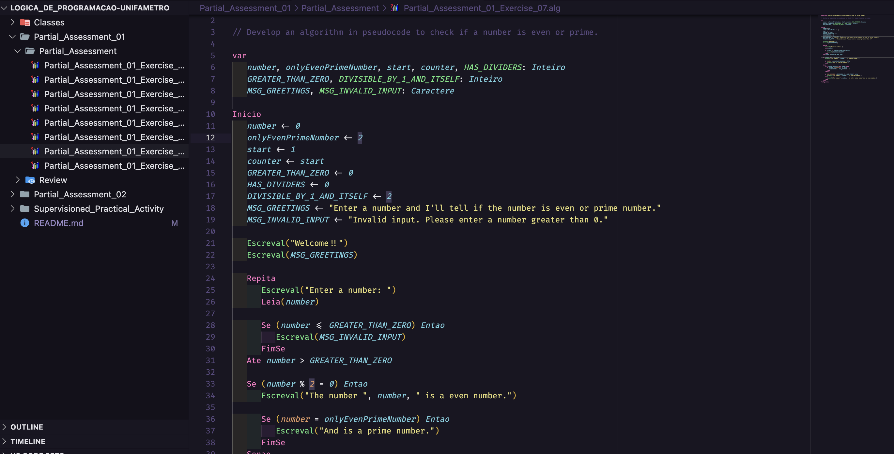
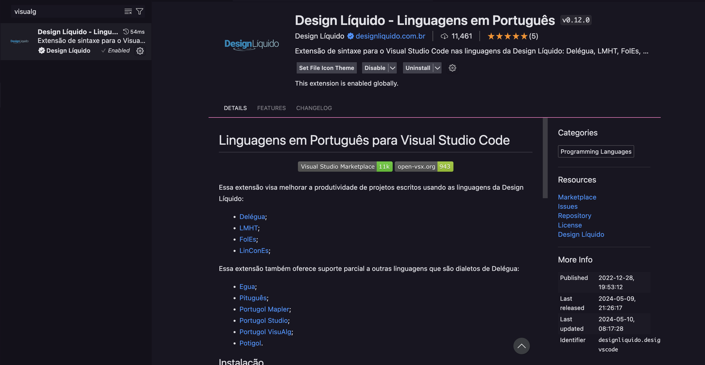

___

# Course: Programming Logic - Unifametro

###### Instructor: Júlio Alcântara

###### Hours: 60h

###### University: [Unifametro](https://unifametro.edu.br/)

###### Completion: 08/12/2016

___

## 

 " Welcome to my Logic Programming repository, a comprehensive collection derived from my college coursework. Explore essential programming concepts such as conditional statements, nested conditionals, loops, and arrays. This repository serves as a practical resource for understanding these foundational elements.Let's explore the ins and outs of logical programming together!"

 This project uses the extension `Design Líquido - Linguagens em Português` created by [Design Liquido](https://designliquido.com.br) to run the codes.

 ---

## 
